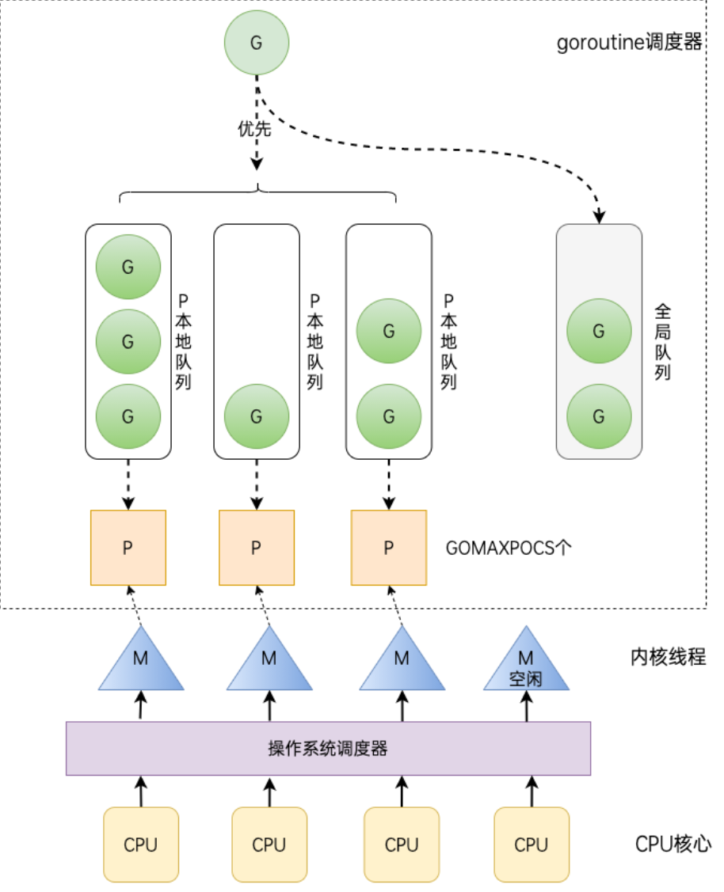
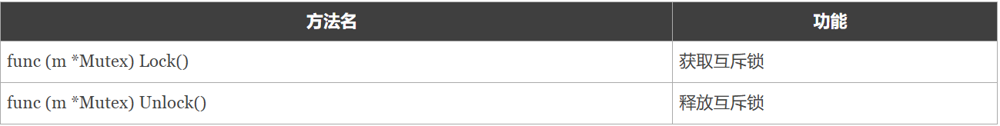
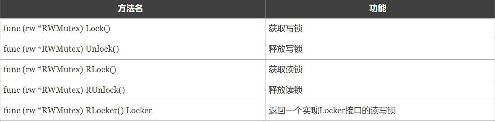
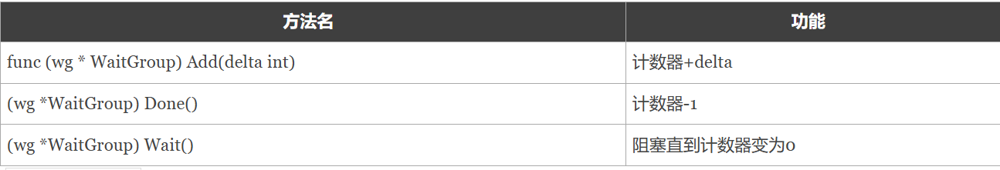
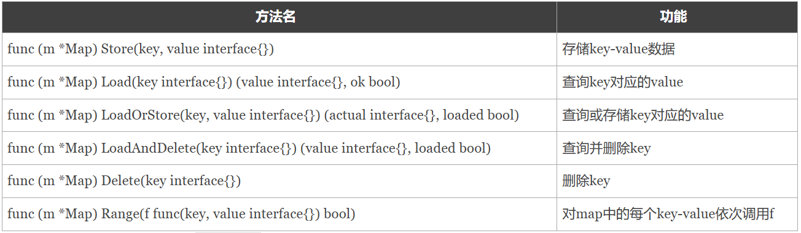

### 并发
首先先了解下面几个概念：

并发：同一时间段内执行多个任务。

并行：同一时刻执行多个任）。

进程：程序在操作系统中的一次执行过程，系统进行资源分配和调度的一个独立单位。

线程：操作系统基于进程开启的轻量级进程，是操作系统调度执行的最小单位。

协程：非操作系统提供而是由用户自行创建和控制的用户态‘线程’，比线程更轻量级。（多开协程是并发的，但是调度是随机的）


### GMP调度模型


G：表示 goroutine，每执行一次go f()就创建一个 G，包含要执行的函数和上下文信息。

全局队列（Global Queue）：存放等待运行的 G。

P：表示 goroutine 执行所需的资源，最多有 GOMAXPROCS 个。

P 的本地队列：同全局队列类似，存放的也是等待运行的G，存的数量有限，不超过256个。新建 G 时，G 优先加入到 P 的本地队列，如果本地队列满了会批量移动部分 G 到全局队列。

M：线程想运行任务就得获取 P，从 P 的本地队列获取 G，当 P 的本地队列为空时，M 也会尝试从全局队列或其他 P 的本地队列获取 G。M 运行 G，G 执行之后，M 会从 P 获取下一个 G，不断重复下去。

Goroutine 调度器和操作系统调度器是通过 M 结合起来的，每个 M 都代表了1个内核线程，操作系统调度器负责把内核线程分配到 CPU 的核上执行。

单从线程调度讲，Go语言相比起其他语言的优势在于OS线程是由OS内核来调度的， goroutine 则是由Go运行时（runtime）自己的调度器调度的，完全是在用户态下完成的， 不涉及内核态与用户态之间的频繁切换，包括内存的分配与释放，都是在用户态维护着一块大的内存池， 不直接调用系统的malloc函数（除非内存池需要改变），成本比调度OS线程低很多。 另一方面充分利用了多核的硬件资源，近似的把若干goroutine均分在物理线程上， 再加上本身 goroutine 的超轻量级，以上种种特性保证了 goroutine 调度方面的性能。

### 通道（channel）

通道是并发安全的

一个通道值是可以被垃圾回收掉的。通道通常由发送方执行关闭操作，并且只有在接收方明确等待通道关闭的信号时才需要执行关闭操作。它和关闭文件不一样，通常在结束操作之后关闭文件是必须要做的，但关闭通道不是必须的。

关闭后的通道有以下特点：

对一个关闭的通道再发送值就会导致 panic。
对一个关闭的通道再关闭也会导致 panic。
对一个关闭的通道进行接收会一直获取值直到通道为空。
对一个关闭的并且没有值的通道执行接收操作会得到对应类型的零值。
关闭一个已经关闭的通道会导致 panic。

通道分无缓冲通道和有缓冲通道
```go
ch0 := make(chan int)//无缓冲通道
ch1 := make(chan bool, 1)//有缓冲通道
```
**无缓冲的通道**只有在有接收方能够接收值的时候才能发送成功，否则会一直处于发送的阶段（阻塞），相反，如果接收操作先执行，接收方将阻塞，直到向该通道发送值。
```go
func recv(c chan int) {
	ret := <-c
	fmt.Println("接收成功", ret)
}

func main() {
	ch := make(chan int)
	go recv(ch) // 创建一个 goroutine 从通道接收值
	ch <- 10 
	fmt.Println("发送成功")
}
```
如果没有go recv(ch)创建了一个协程接收无缓冲通道ch的值，就会阻塞在ch <- 10这一步，deadlock！

**有缓冲通道**，通道的容量表示通道中最大能存放的元素数量。当通道内已有元素数达到最大容量后，再向通道执行发送操作就会阻塞，除非有从通道执行接收操作。
```go
func main() {
	ch := make(chan int, 10) // 创建一个容量为10的有缓冲区通道
	for i := 0; i < 10; i++{
        ch <- 10
    }
    //最多发送10个数据，在发送就会阻塞，除非有从通道执行接收操作。
	fmt.Println("发送成功")
}
```
此外还有**单向通道**
```go
<- chan int // 只接收通道，只能接收不能发送
chan <- int // 只发送通道，只能发送不能接收
```
对一个通道执行接收操作时支持使用如下**多返回值模式**。能判断通道是否关闭。
```go
value, ok := <- ch
```
value：从通道中取出的值，如果通道被关闭则返回对应类型的零值。
ok：通道ch关闭时返回 false，否则返回 true。
```go
v, ok := <-ch
if !ok {
	fmt.Println("通道已关闭")
}
```
**for-range**遍历通道，当通道被关闭后，会在通道内的所有值被接收完毕后会自动退出循环,比用多返回值模式更简洁
```go
func f(ch chan int) {
	for v := range ch {
		fmt.Println(v)
	}
}
```

**select语句**
特点：

可处理一个或多个 channel 的发送/接收操作。
如果多个 case 同时满足，select 会随机选择一个执行。
对于没有 case 的 select 会一直阻塞，可用于阻塞 main 函数，防止退出。
```go
//这是一个输出10以内的奇数的函数
func main() {
	ch := make(chan int, 1)
	for i := 1; i <= 10; i++ {
		select {
		case x := <-ch:
			fmt.Println(x)
		case ch <- i:
		}
	}
}
```

### 并发安全
**互斥锁**
互斥锁是一种常用的控制共享资源访问的方法，它能够保证同一时间只有一个 goroutine 可以访问共享资源。



**读写锁**
读写锁分为两种：读锁和写锁。

当一个 goroutine 获取到读锁之后，其他的 goroutine 如果是获取读锁会继续获得锁（读锁可以有多个），如果是获取写锁就会等待；而当一个 goroutine 获取写锁之后，其他的 goroutine 无论是获取读锁还是写锁都会等待。


```go
var mutex sync.Mutex // 互斥锁
var rwMutex sync.RWMutex//读写锁
```

使用读写互斥锁在读多写少的场景下能够极大地提高程序的性能。不过需要注意的是如果一个程序中的读操作和写操作数量级差别不大，那么读写互斥锁的优势就发挥不出来。

**sync.WaitGroup**
利用sync.WaitGroup替代time.Sleep()让main主线程等待协程执行完毕


```go
var wg sync.WaitGroup

func hello() {
	defer wg.Done()
	fmt.Println("Hello Goroutine!")
}
func main() {
	wg.Add(1)
	go hello() // 启动另外一个goroutine去执行hello函数
	fmt.Println("main goroutine done!")
	wg.Wait()
}
```

**sync.Once**
在某些场景下我们需要确保某些操作即使在高并发的场景下也只会被执行一次，例如只加载一次配置文件等。

Go语言中的sync包中提供了一个针对只执行一次场景的解决方案——sync.Once，sync.Once只有一个Do方法，其签名如下：
```go
func (o *Once) Do(f func())
```

如果要执行的函数 f 需要传递参数就需要搭配闭包来使用。

```go
var loadIconsOnce sync.Once

func loadIcons() {
	//配置文件
}

// Icon 是并发安全的
func Icon() {
	loadIconsOnce.Do(loadIcons)
}
```

**sync.Map**
Go 语言中内置的 map 不是并发安全的，就需要为 map 加锁来保证并发的安全性了，Go语言的sync包中提供了一个开箱即用的并发安全版 map——sync.Map。开箱即用表示其不用像内置的 map 一样使用 make 函数初始化就能直接使用。


```go
var m = sync.Map{}

func main() {
	wg := sync.WaitGroup{}
	// 对m执行20个并发的读写操作
	for i := 0; i < 20; i++ {
		wg.Add(1)
		go func(n int) {
			key := strconv.Itoa(n)
			m.Store(key, n)         // 存储key-value
			value, _ := m.Load(key) // 根据key取值
			fmt.Printf("k=:%v,v:=%v\n", key, value)
			wg.Done()
		}(i)
	}
	wg.Wait()
}
```

### 练习：交替输出奇偶数
```go
//两个通道实现
func main() {
	// 创建两个无缓冲通道
	oddChan := make(chan int)  // 奇数通道
	evenChan := make(chan int) // 偶数通道

	var wg sync.WaitGroup
	wg.Add(2)

	// 启动奇数打印 goroutine
	go func() {
		defer wg.Done()
		for num := range oddChan {
			fmt.Printf("奇数: %d\n", num)
			evenChan <- num + 1 // 通知打印偶数
		}
	}()

	// 启动偶数打印 goroutine
	go func() {
		defer wg.Done()
		for num := range evenChan {
			fmt.Printf("偶数: %d\n", num)
			if num >= 10 { // 设置终止条件
				close(oddChan)
				return
			}
			oddChan <- num + 1 // 通知打印奇数
		}
	}()

	// 开始打印序列（从1开始）
	oddChan <- 1

	// 等待所有 goroutine 完成
	wg.Wait()
	close(evenChan)
}

//一个通道实现
func main() {
	// 创建一个无缓冲通道
	numChan := make(chan int)

	var wg sync.WaitGroup
	wg.Add(2) // 等待两个goroutine

	// 启动打印goroutine
	go func() {
		defer wg.Done()
		for num := range numChan {
			if num%2 == 1 {
				fmt.Printf("奇数: %d\n", num)
			} else {
				fmt.Printf("偶数: %d\n", num)
			}
		}
	}()

	// 启动控制goroutine
	go func() {
		defer wg.Done()
		defer close(numChan) // 关闭通道
		
		for i := 1; i <= 10; i++ {
			numChan <- i
		}
	}()

	wg.Wait()
}
```

### 思考：协程阻塞的原因

1.无缓冲通道
```go
ch := make(chan int) // 无缓冲通道
ch0 := make(chan int)// 无缓冲通道
ch <- 42            // 发送操作会阻塞，直到有接收者准备好

val := <-ch0 // 接收操作会阻塞，直到有数据可接收
```
2.有缓冲通道
```go
ch := make(chan int, 3) // 缓冲大小为3
ch <- 1; ch <- 2; ch <- 3
ch <- 4 // 第4次发送会阻塞，直到有元素被接收
```
3.wg.Wait()
```go
var wg sync.WaitGroup
wg.Add(1)
go func() {
    defer wg.Done()
    // 工作代码
}()
wg.Wait() // 阻塞直到计数器归零
```

4.Mutex锁
```go
var mu sync.Mutex
mu.Lock()   // 如果锁已被其他goroutine持有，会阻塞
// 临界区
mu.Unlock()
```

5.select阻塞
```go
select {
case <-ch1:
    // 处理ch1
case <-ch2:
    // 处理ch2
default:
    // 非阻塞操作
}
// 如果没有default且所有case都不可用，select会阻塞
