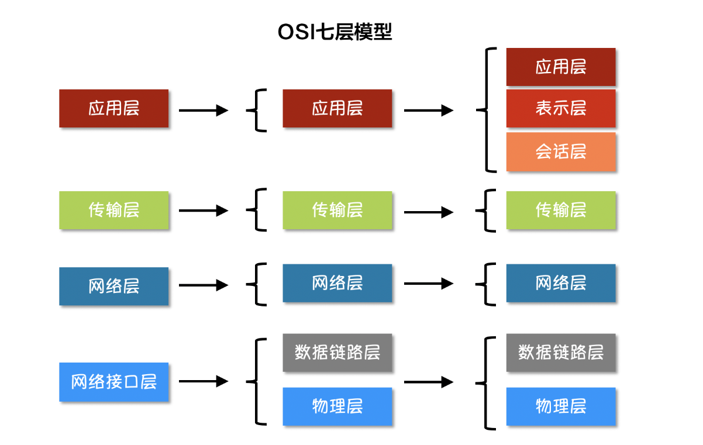

# 网络协议
互联网按照不同的模型划分会有不用的分层，但是不论按照什么模型去划分，越往上的层越靠近用户，越往下的层越靠近硬件。


在软件开发中我们使用最多的是上图中将互联网划分为五个分层的模型。


### TCP

TCP/IP 是一种面向连接（连接导向）的、可靠的、基于字节流的传输层通信协议，因为是面向连接的协议，数据像水流一样传输，会存在黏包问题

### UDP

UDP 不需要建立连接就能直接进行数据发送和接收，属于不可靠的、没有时序的通信，但是UDP协议的实时性比较好，通常用于视频直播相关领域。

### 粘包

主要原因就是tcp数据传递模式是流模式，在保持长连接的时候可以进行多次的收和发。

“粘包”可发生在发送端也可发生在接收端。

**解决办法**

出现”粘包”的关键在于接收方不确定将要传输的数据包的大小，因此我们可以对数据包进行封包和拆包的操作。

封包：封包就是给一段数据加上包头，这样一来数据包就分为包头和包体两部分内容了。包头部分的长度是固定的，并且它存储了包体的长度，根据包头长度固定以及包头中含有包体长度的变量就能正确的拆分出一个完整的数据包。
```go
const maxMessageLength = 1 << 20 // 1MB，最大消息长度限制

// 向连接发送消息
func SendMessage(conn net.Conn, message []byte) error {
	length := uint32(len(message)) // 消息长度
	if length > maxMessageLength {
		log.Println("消息长度超出限制: ", length)
		return fmt.Errorf("message too long")
	}
	// 写入消息长度
	err := binary.Write(conn, binary.BigEndian, length) //将数据以二进制写入conn
	if err != nil {
		log.Printf("写入消息长度时出错: %v", err)
		return err
	}
	// 写入消息内容
	_, err = conn.Write(message)
	if err != nil {
		log.Printf("写入消息内容时出错: %v", err)
	}
	return err
}

// 从连接读取消息
func ReadMessage(reader *bufio.Reader) ([]byte, error) {
	var length uint32                                     // 消息长度
	err := binary.Read(reader, binary.BigEndian, &length) //从reader中读取二进制数据并解析为结构化数据，自动填充到length中
	if err != nil {
		log.Printf("读取消息长度时出错: %v", err)
		return nil, err
	}
	if length > maxMessageLength {
		log.Println("消息长度超出限制:", length)
		return nil, fmt.Errorf("message too long")
	}
	// 读取消息内容
	message := make([]byte, length)
	_, err = io.ReadFull(reader, message)
	if err != nil {
		log.Printf("读取消息内容时出错: %v", err)
		return nil, err
	}
	return message, nil
}
```
