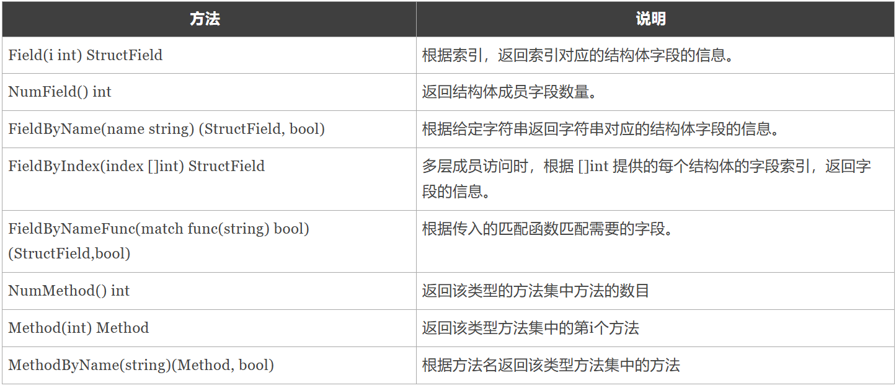

## 反射
**反射操作**

reflect.TypeOf()可以获得任意值的类型对象（reflect.Type），程序通过类型对象可以访问任意值的类型信息。

在反射中关于类型还划分为两种：类型（Type）和种类（Kind）

```go
    type stu struct {
	Name string `json:"name"`
	Age  int
    }
    s := stu{"aaa", 18}
    typ := reflect.TypeOf(s)//main.stu
    typ.kind()//struct
```

reflect.ValueOf()返回的是reflect.Value类型，其中包含了原始值的值信息。reflect.Value与原始值之间可以互相转换。

通过反射获取值

```go
    val := reflect.ValueOf(10)//val 是reflect.Value
    //转换为空接口类型
    val.Interface()
```
通过反射修改值

```go
func sen(s *stu) {
	val := reflect.ValueOf(s)
	//通过字段名修改值
	val.Elem().FieldByName("Name").SetString("ccc")
	//通过字段顺序修改值
	val.Elem().Field(0).SetString("bbb")
}

func main() {
	s := stu{"aaa", 18}
        //修改值传的一定要是地址传递
	sen(&s)
}
```
isNil()和isValid()

IsNil()报告v持有的值是否为nil。v持有的值的分类必须是通道、函数、接口、映射、指针、切片之一；否则IsNil函数会导致panic。

IsValid()返回v是否持有一个值。如果v是Value零值会返回假，此时v除了IsValid、String、Kind之外的方法都会导致panic。
```go
func (v Value) IsNil() bool
func (v Value) IsValid() bool
```
**结构体反射**
任意值通过reflect.TypeOf()获得反射对象信息后，如果它的类型是结构体，可以通过反射值对象（reflect.Type）的NumField()和Field()方法获得结构体成员的详细信息。

reflect.Type中与获取结构体成员相关的的方法如下表所示。

```go
func sen(s *stu) {
	val := reflect.ValueOf(s)
	//通过字段名修改值
	val.Elem().FieldByName("Name").SetString("ccc")
	//通过字段顺序修改值
	val.Elem().Field(0).SetString("bbb")
	//调用结构体绑定的方法，方法按照首字母排序
	//val.Method(0).Call(nil)  等同下面
	method := val.Method(0)
	method.Call(nil)
}

func main() {
	s := stu{"aaa", 18}
	typ := reflect.TypeOf(s)
	fmt.Println("typ ", typ)
	fmt.Println("typ.kind ", typ.Kind())
	fmt.Println("typ.NumMethod(结构体绑定的方法...) ", typ.NumMethod())
	fmt.Println("typ.NumField(结构体的字段数量...) ", typ.NumField())
    //遍历获取json形式的字段名
	for i := 0; i < typ.NumField(); i++ {
		tag := typ.Field(i).Tag.Get("json")
		if tag != "" {
			fmt.Println(tag)
		}
	}
    //修改值
	sen(&s)
	fmt.Println(s)
	//通过反射创建新的结构体
	result := reflect.New(typ).Elem().Interface().(stu)
	result.Name = "小斌三"
	result.Age = 18
	fmt.Println(result)
}

```